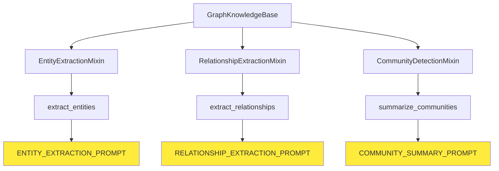
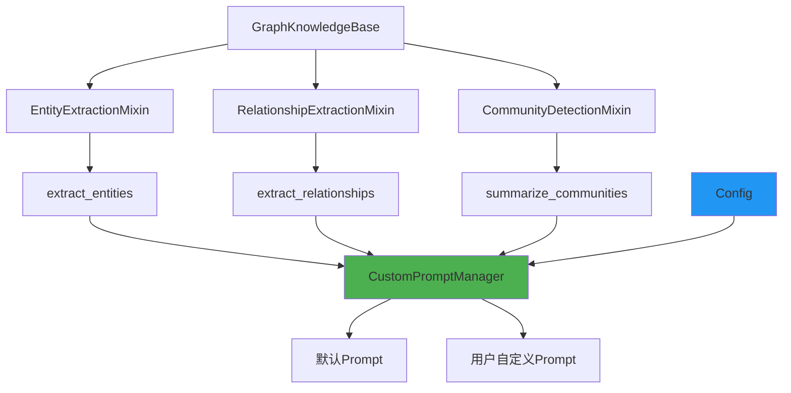

# GraphRAG 自定义Prompt支持方案

## 📋 概述

本文档详细介绍了AgentScope GraphRAG模块的自定义Prompt支持方案，允许用户完全控制实体提取、关系抽取和社区摘要的生成过程。

## 🎯 设计目标

- **最小改动**: 在现有API基础上扩展，不破坏向后兼容性
- **完全自定义**: 支持用户定义所有关键步骤的Prompt
- **统一配置**: 通过配置文件统一管理所有自定义Prompt
- **灵活切换**: 支持默认Prompt和自定义Prompt的无缝切换

## 🏗️ 架构设计

### 当前架构分析



### 扩展后架构



## 📝 实现方案

### 1. 配置结构扩展

#### 当前配置结构
```python
@dataclass
class GraphRAGConfig:
    """GraphRAG配置"""
    # 基础配置
    model: ModelWrapperBase
    embedding_model: Optional[EmbeddingWrapperBase] = None

    # 存储配置
    graph_store: Optional[GraphStoreBase] = None

    # 实体提取配置
    entity_types: List[str] = field(default_factory=lambda: ["organization", "person", "location", "event", "misc"])
    max_entities: int = 50

    # 关系提取配置
    max_relationships: int = 100

    # 社区检测配置
    community_detection_algorithm: str = "leiden"
    community_summary_max_length: int = 500
```

#### 扩展后配置结构
```python
@dataclass
class GraphRAGConfig:
    """GraphRAG配置"""
    # 基础配置
    model: ModelWrapperBase
    embedding_model: Optional[EmbeddingWrapperBase] = None

    # 存储配置
    graph_store: Optional[GraphStoreBase] = None

    # 实体提取配置
    entity_types: List[str] = field(default_factory=lambda: ["organization", "person", "location", "event", "misc"])
    max_entities: int = 50

    # 关系提取配置
    max_relationships: int = 100

    # 社区检测配置
    community_detection_algorithm: str = "leiden"
    community_summary_max_length: int = 500

    # 🆕 自定义Prompt配置
    custom_prompts: Optional[Dict[str, str]] = None
    """
    自定义Prompt配置字典，支持以下键：
    - "entity_extraction": 实体提取Prompt
    - "relationship_extraction": 关系提取Prompt
    - "community_summary": 社区摘要Prompt

    示例：
    {
        "entity_extraction": "从以下文本中提取{entity_types}类型的实体...",
        "relationship_extraction": "基于以下实体和文本，提取它们之间的关系...",
        "community_summary": "为以下社区生成简洁的摘要..."
    }
    """
```

### 2. Prompt管理器实现

```python
class CustomPromptManager:
    """自定义Prompt管理器"""

    def __init__(self, custom_prompts: Optional[Dict[str, str]] = None):
        """
        初始化Prompt管理器

        Args:
            custom_prompts: 用户自定义Prompt字典
        """
        self.custom_prompts = custom_prompts or {}
        self.default_prompts = {
            "entity_extraction": ENTITY_EXTRACTION_PROMPT,
            "relationship_extraction": RELATIONSHIP_EXTRACTION_PROMPT,
            "community_summary": COMMUNITY_SUMMARY_PROMPT,
        }

    def get_prompt(self, prompt_type: str) -> str:
        """
        获取指定类型的Prompt

        Args:
            prompt_type: Prompt类型 ("entity_extraction", "relationship_extraction", "community_summary")

        Returns:
            对应的Prompt字符串
        """
        return self.custom_prompts.get(prompt_type, self.default_prompts[prompt_type])

    def format_prompt(self, prompt_type: str, **kwargs) -> str:
        """
        格式化Prompt

        Args:
            prompt_type: Prompt类型
            **kwargs: 格式化参数

        Returns:
            格式化后的Prompt字符串
        """
        prompt = self.get_prompt(prompt_type)
        return prompt.format(**kwargs)
```

### 3. Mixin类修改

#### EntityExtractionMixin修改
```python
class EntityExtractionMixin:
    """实体提取Mixin"""

    def __init__(self, *args, **kwargs):
        super().__init__(*args, **kwargs)
        # 🆕 初始化Prompt管理器
        self.prompt_manager = CustomPromptManager(
            custom_prompts=getattr(self.config, 'custom_prompts', None)
        )

    def extract_entities(self, text: str) -> List[Entity]:
        """从文本中提取实体"""
        # 🆕 使用自定义Prompt
        prompt = self.prompt_manager.format_prompt(
            "entity_extraction",
            entity_types=", ".join(self.config.entity_types),
            text=text
        )

        response = self._model(prompt)
        return self._parse_entities(response)
```

#### RelationshipExtractionMixin修改
```python
class RelationshipExtractionMixin:
    """关系提取Mixin"""

    def __init__(self, *args, **kwargs):
        super().__init__(*args, **kwargs)
        # 🆕 初始化Prompt管理器
        self.prompt_manager = CustomPromptManager(
            custom_prompts=getattr(self.config, 'custom_prompts', None)
        )

    def extract_relationships(self, text: str, entities: List[Entity]) -> List[Relationship]:
        """从文本和实体中提取关系"""
        # 🆕 使用自定义Prompt
        prompt = self.prompt_manager.format_prompt(
            "relationship_extraction",
            entities=self._format_entities(entities),
            text=text
        )

        response = self._model(prompt)
        return self._parse_relationships(response)
```

#### CommunityDetectionMixin修改
```python
class CommunityDetectionMixin:
    """社区检测Mixin"""

    def __init__(self, *args, **kwargs):
        super().__init__(*args, **kwargs)
        # 🆕 初始化Prompt管理器
        self.prompt_manager = CustomPromptManager(
            custom_prompts=getattr(self.config, 'custom_prompts', None)
        )

    def summarize_communities(self, communities: List[Community]) -> List[Community]:
        """为社区生成摘要"""
        summarized_communities = []

        for community in communities:
            # 🆕 使用自定义Prompt
            prompt = self.prompt_manager.format_prompt(
                "community_summary",
                community_info=self._format_community(community),
                max_length=self.config.community_summary_max_length
            )

            response = self._model(prompt)
            summary = self._parse_summary(response)

            community.summary = summary
            summarized_communities.append(community)

        return summarized_communities
```

## 🚀 使用示例

### 1. 基础使用（默认Prompt）

```python
from agentscope.rag import GraphKnowledgeBase, GraphRAGConfig
from agentscope.models import OpenAIWrapper

# 使用默认Prompt
config = GraphRAGConfig(
    model=OpenAIWrapper(config_name="gpt-4"),
    entity_types=["person", "organization", "location"]
)

kb = GraphKnowledgeBase(config)
```

### 2. 自定义Prompt使用

```python
from agentscope.rag import GraphKnowledgeBase, GraphRAGConfig
from agentscope.models import OpenAIWrapper

# 定义自定义Prompt
custom_prompts = {
    "entity_extraction": """
    你是一个专业的实体识别专家。请从以下文本中提取{entity_types}类型的实体。

    要求：
    1. 只提取指定的实体类型
    2. 每个实体包含名称、类型和置信度
    3. 置信度范围0-1
    4. 输出JSON格式

    文本：{text}

    实体列表：
    """,

    "relationship_extraction": """
    基于以下实体和文本，提取它们之间的关系。

    实体：
    {entities}

    文本：{text}

    请提取实体间的关系，包括：
    - 源实体
    - 目标实体
    - 关系类型
    - 关系强度
    - 支持证据

    输出JSON格式：
    """,

    "community_summary": """
    为以下社区生成简洁的摘要，不超过{max_length}字符。

    社区信息：
    {community_info}

    摘要要求：
    1. 突出社区核心特征
    2. 包含主要实体和关系
    3. 语言简洁明了
    4. 控制在指定长度内

    摘要：
    """
}

# 使用自定义Prompt
config = GraphRAGConfig(
    model=OpenAIWrapper(config_name="gpt-4"),
    entity_types=["person", "organization", "location"],
    custom_prompts=custom_prompts
)

kb = GraphKnowledgeBase(config)
```

### 3. 部分自定义Prompt

```python
# 只自定义实体提取Prompt，其他使用默认
custom_prompts = {
    "entity_extraction": "你的自定义实体提取Prompt..."
}

config = GraphRAGConfig(
    model=OpenAIWrapper(config_name="gpt-4"),
    custom_prompts=custom_prompts
)
```

## 📋 实现清单

### 需要修改的文件

| 文件路径 | 修改类型 | 行数估计 | 说明 |
|---------|---------|---------|------|
| `src/agentscope/rag/_graph/_types.py` | 扩展 | ~15行 | 扩展GraphRAGConfig配置类 |
| `src/agentscope/rag/_graph/_entity.py` | 修改 | ~10行 | 修改EntityExtractionMixin |
| `src/agentscope/rag/_graph/_relationship.py` | 修改 | ~10行 | 修改RelationshipExtractionMixin |
| `src/agentscope/rag/_graph/_community.py` | 修改 | ~10行 | 修改CommunityDetectionMixin |
| `src/agentscope/rag/_graph/_knowledge_base.py` | 新增 | ~10行 | 添加CustomPromptManager类 |

**总计**: ~55行代码修改

### 需要新增的文件

| 文件路径 | 类型 | 说明 |
|---------|------|------|
| `docs/graph_rag_custom_prompt_guide.md` | 文档 | 本文档 |

## 🧪 测试策略

### 1. 单元测试

```python
def test_custom_prompt_manager():
    """测试自定义Prompt管理器"""
    custom_prompts = {
        "entity_extraction": "自定义实体提取Prompt：{text}"
    }

    manager = CustomPromptManager(custom_prompts)

    # 测试获取自定义Prompt
    assert manager.get_prompt("entity_extraction") == "自定义实体提取Prompt：{text}"

    # 测试获取默认Prompt
    assert manager.get_prompt("relationship_extraction") == RELATIONSHIP_EXTRACTION_PROMPT

    # 测试格式化
    formatted = manager.format_prompt("entity_extraction", text="测试文本")
    assert "测试文本" in formatted

def test_mixed_custom_prompts():
    """测试混合使用自定义和默认Prompt"""
    custom_prompts = {
        "entity_extraction": "自定义实体提取Prompt"
        # 只自定义部分Prompt
    }

    config = GraphRAGConfig(
        model=MockModel(),
        custom_prompts=custom_prompts
    )

    kb = GraphKnowledgeBase(config)

    # 验证自定义Prompt生效
    assert kb.prompt_manager.get_prompt("entity_extraction") == "自定义实体提取Prompt"

    # 验证默认Prompt仍然可用
    assert kb.prompt_manager.get_prompt("relationship_extraction") == RELATIONSHIP_EXTRACTION_PROMPT
```

### 2. 集成测试

```python
def test_end_to_end_custom_prompts():
    """端到端测试自定义Prompt"""
    custom_prompts = {
        "entity_extraction": """
        从文本中提取实体，格式：[实体名称](实体类型)
        文本：{text}
        实体：
        """,
        "relationship_extraction": """
        提取关系，格式：实体1 --关系类型--> 实体2
        实体：{entities}
        文本：{text}
        关系：
        """,
        "community_summary": """
        社区摘要：{community_info}
        摘要：
        """
    }

    config = GraphRAGConfig(
        model=MockModel(),
        custom_prompts=custom_prompts
    )

    kb = GraphKnowledgeBase(config)

    # 测试完整的知识提取流程
    text = "苹果公司的CEO蒂姆·库克在加州库比蒂诺发布了新款iPhone。"

    # 添加文档
    kb.add_document(text)

    # 验证结果
    assert len(kb.get_entities()) > 0
    assert len(kb.get_relationships()) > 0
```

## 🔄 向后兼容性

### 兼容性保证

1. **配置兼容**: 现有配置文件无需修改，`custom_prompts`参数为可选
2. **API兼容**: 所有现有API保持不变
3. **行为兼容**: 未提供自定义Prompt时，行为与之前完全一致

### 迁移指南

#### 从现有代码迁移

```python
# 现有代码（无需修改）
config = GraphRAGConfig(
    model=OpenAIWrapper(config_name="gpt-4"),
    entity_types=["person", "organization"]
)

# 迁移到自定义Prompt（可选）
config = GraphRAGConfig(
    model=OpenAIWrapper(config_name="gpt-4"),
    entity_types=["person", "organization"],
    custom_prompts={
        "entity_extraction": "你的自定义Prompt..."
    }
)
```

## 📚 最佳实践

### 1. Prompt设计原则

- **明确性**: Prompt应该明确指定期望的输出格式
- **约束性**: 提供清晰的约束条件和示例
- **一致性**: 保持Prompt风格的一致性
- **可测试性**: Prompt应该易于测试和验证

### 2. 性能优化

- **缓存Prompt**: 避免重复格式化相同的Prompt
- **批量处理**: 对于大量文档，考虑批量处理
- **异步调用**: 使用异步API提高处理效率

### 3. 错误处理

```python
class CustomPromptManager:
    def get_prompt(self, prompt_type: str) -> str:
        """获取Prompt，包含错误处理"""
        try:
            if prompt_type not in self.default_prompts:
                raise ValueError(f"不支持的Prompt类型: {prompt_type}")

            return self.custom_prompts.get(prompt_type, self.default_prompts[prompt_type])
        except Exception as e:
            logger.error(f"获取Prompt失败: {e}")
            # 返回默认Prompt作为后备
            return self.default_prompts.get(prompt_type, "")
```

## 🔮 未来扩展

### 1. 模板系统

未来可以考虑引入更强大的模板系统：

```python
from jinja2 import Template

class AdvancedPromptManager:
    def __init__(self, custom_prompts: Optional[Dict[str, str]] = None):
        self.custom_prompts = custom_prompts or {}
        self.templates = {
            prompt_type: Template(prompt)
            for prompt_type, prompt in self.custom_prompts.items()
        }

    def render_prompt(self, prompt_type: str, **kwargs) -> str:
        """使用Jinja2模板渲染Prompt"""
        if prompt_type in self.templates:
            return self.templates[prompt_type].render(**kwargs)
        return self.default_prompts.get(prompt_type, "")
```

### 2. Prompt版本管理

```python
@dataclass
class PromptVersion:
    version: str
    prompt: str
    created_at: datetime
    description: str

class VersionedPromptManager:
    def __init__(self):
        self.versions: Dict[str, List[PromptVersion]] = {}

    def add_version(self, prompt_type: str, prompt: str, description: str = ""):
        """添加Prompt版本"""
        version = PromptVersion(
            version=f"v{len(self.versions.get(prompt_type, [])) + 1}",
            prompt=prompt,
            created_at=datetime.now(),
            description=description
        )

        if prompt_type not in self.versions:
            self.versions[prompt_type] = []

        self.versions[prompt_type].append(version)

    def get_prompt(self, prompt_type: str, version: Optional[str] = None) -> str:
        """获取指定版本的Prompt"""
        if prompt_type not in self.versions:
            return self.default_prompts.get(prompt_type, "")

        if version is None:
            # 返回最新版本
            return self.versions[prompt_type][-1].prompt

        for v in self.versions[prompt_type]:
            if v.version == version:
                return v.prompt

        raise ValueError(f"未找到版本 {version} 的Prompt {prompt_type}")
```

## 📖 总结

本自定义Prompt支持方案通过最小化的代码改动，为GraphRAG模块提供了完全的Prompt自定义能力。主要特点包括：

1. **向后兼容**: 现有代码无需修改
2. **灵活配置**: 支持部分或全部Prompt自定义
3. **统一管理**: 通过配置文件统一管理所有Prompt
4. **易于扩展**: 为未来的功能扩展预留了空间

该方案将显著提升GraphRAG模块的灵活性和可定制性，满足不同场景下的特定需求。