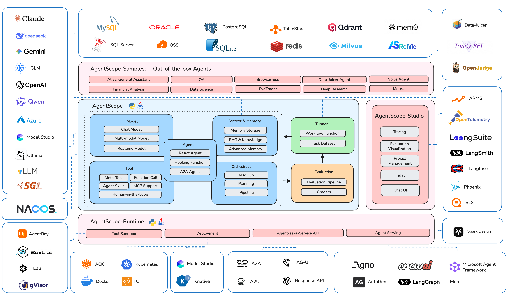

<p align="center">
  
</p>

<span align="center">

[**中文主页**](https://github.com/agentscope-ai/agentscope/blob/main/README_zh.md) | [**Tutorial**](https://doc.agentscope.io/) | [**Roadmap (Jan 2026 -)**](https://github.com/agentscope-ai/agentscope/blob/main/docs/roadmap.md) | [**FAQ**](https://doc.agentscope.io/tutorial/faq.html)

</span>

<p align="center">
    <a href="https://arxiv.org/abs/2402.14034">
        
    </a>
    <a href="https://pypi.org/project/agentscope/">
        
    </a>
    <a href="https://pypi.org/project/agentscope/">
        
    </a>
    <a href="https://discord.gg/eYMpfnkG8h">
        
    </a>
    <a href="https://doc.agentscope.io/">
        
    </a>
    <a href="./LICENSE">
        
    </a>
</p>

<p align="center">

</p>

## What is AgentScope?

AgentScope is a production-ready, easy-to-use agent framework with essential abstractions that work with rising model capability and built-in support for finetuning.

We design for increasingly agentic LLMs.
Our approach leverages the models' reasoning and tool use abilities
rather than constraining them with strict prompts and opinionated orchestrations.

## Why use AgentScope?

- **Simple**: start building your agents in 5 minutes with built-in ReAct agent, tools, skills, human-in-the-loop steering, memory, planning, realtime voice, evaluation and model finetuning
- **Extensible**: large number of ecosystem integrations for tools, memory and observability; built-in support for MCP and A2A; message hub for flexible multi-agent orchestration and workflows
- **Production-ready**: deploy and serve your agents locally, as serverless in the cloud, or on your K8s cluster with built-in OTel support


<p align="center">

<br/>
The AgentScope Ecosystem
</p>


## News
<!-- BEGIN NEWS -->
- **[2026-01] `COMM`:** Biweekly Meetings launched to share ecosystem updates and development plans - join us! [Details & Schedule](https://github.com/agentscope-ai/agentscope/discussions/1126)
- **[2026-01] `FEAT`:** Database support & memory compression in memory module. [Example](https://github.com/agentscope-ai/agentscope/tree/main/examples/functionality/short_term_memory/memory_compression) | [Tutorial](https://doc.agentscope.io/tutorial/task_memory.html)
- **[2025-12] `INTG`:** A2A (Agent-to-Agent) protocol support. [Example](https://github.com/agentscope-ai/agentscope/tree/main/examples/agent/a2a_agent) | [Tutorial](https://doc.agentscope.io/tutorial/task_a2a.html)
- **[2025-12] `FEAT`:** TTS (Text-to-Speech) support. [Example](https://github.com/agentscope-ai/agentscope/tree/main/examples/functionality/tts) | [Tutorial](https://doc.agentscope.io/tutorial/task_tts.html)
- **[2025-11] `INTG`:** Anthropic Agent Skill support. [Example](https://github.com/agentscope-ai/agentscope/tree/main/examples/functionality/agent_skill) | [Tutorial](https://doc.agentscope.io/tutorial/task_agent_skill.html)
- **[2025-11] `RELS`:** Alias-Agent for diverse real-world tasks and Data-Juicer Agent for data processing open-sourced. [Alias-Agent](https://github.com/agentscope-ai/agentscope-samples/tree/main/alias) | [Data-Juicer Agent](https://github.com/agentscope-ai/agentscope-samples/tree/main/data_juicer_agent)
- **[2025-11] `INTG`:** Agentic RL via Trinity-RFT library. [Example](https://github.com/agentscope-ai/agentscope/tree/main/examples/tuner/react_agent) | [Trinity-RFT](https://github.com/agentscope-ai/Trinity-RFT)
- **[2025-11] `INTG`:** ReMe for enhanced long-term memory. [Example](https://github.com/agentscope-ai/agentscope/tree/main/examples/functionality/long_term_memory/reme)
- **[2025-11] `RELS`:** agentscope-samples repository launched and agentscope-runtime upgraded with Docker/K8s deployment and VNC-powered GUI sandboxes. [Samples](https://github.com/agentscope-ai/agentscope-samples) | [Runtime](https://github.com/agentscope-ai/agentscope-runtime)
- **[2025-11] `DOCS`:** Contributing Guide is online - welcome to contribute! [Guide](./CONTRIBUTING.md)
<!-- END NEWS -->

[More news →](./docs/NEWS.md)

## Community

Welcome to join our community on

| [Discord](https://discord.gg/eYMpfnkG8h)                                                                                         | DingTalk                                                                  |
|----------------------------------------------------------------------------------------------------------------------------------|---------------------------------------------------------------------------|
|  |  |

<!-- START doctoc generated TOC please keep comment here to allow auto update -->
<!-- DON'T EDIT THIS SECTION, INSTEAD RE-RUN doctoc TO UPDATE -->
## 📑 Table of Contents

- [Quickstart](#quickstart)
  - [Installation](#installation)
    - [From PyPI](#from-pypi)
    - [From source](#from-source)
- [Example](#example)
  - [Hello AgentScope!](#hello-agentscope)
  - [Voice Agent](#voice-agent)
  - [Human-in-the-loop](#human-in-the-loop)
  - [Flexible MCP Usage](#flexible-mcp-usage)
  - [Agentic RL](#agentic-rl)
  - [Multi-Agent Workflows](#multi-agent-workflows)
- [Documentation](#documentation)
- [More Examples & Samples](#more-examples--samples)
  - [Functionality](#functionality)
  - [Agent](#agent)
  - [Game](#game)
  - [Workflow](#workflow)
  - [Evaluation](#evaluation)
  - [Tuner](#tuner)
- [Contributing](#contributing)
- [License](#license)
- [Publications](#publications)
- [Contributors](#contributors)

<!-- END doctoc generated TOC please keep comment here to allow auto update -->

## Quickstart

### Installation

> AgentScope requires **Python 3.10** or higher.

#### From PyPI

```bash
pip install agentscope
```

Or with uv:

```bash
uv pip install agentscope
```

#### From source

```bash
# Pull the source code from GitHub
git clone -b main https://github.com/agentscope-ai/agentscope.git

# Install the package in editable mode
cd agentscope

pip install -e .
# or with uv:
# uv pip install -e .
```


## Example

### Hello AgentScope!

Start with a conversation between user and a ReAct agent 🤖 named "Friday"!

```python
from agentscope.agent import ReActAgent, UserAgent
from agentscope.model import DashScopeChatModel
from agentscope.formatter import DashScopeChatFormatter
from agentscope.memory import InMemoryMemory
from agentscope.tool import Toolkit, execute_python_code, execute_shell_command
import os, asyncio


async def main():
    toolkit = Toolkit()
    toolkit.register_tool_function(execute_python_code)
    toolkit.register_tool_function(execute_shell_command)

    agent = ReActAgent(
        name="Friday",
        sys_prompt="You're a helpful assistant named Friday.",
        model=DashScopeChatModel(
            model_name="qwen-max",
            api_key=os.environ["DASHSCOPE_API_KEY"],
            stream=True,
        ),
        memory=InMemoryMemory(),
        formatter=DashScopeChatFormatter(),
        toolkit=toolkit,
    )

    user = UserAgent(name="user")

    msg = None
    while True:
        msg = await agent(msg)
        msg = await user(msg)
        if msg.get_text_content() == "exit":
            break

asyncio.run(main())
```

### Voice Agent

Create a voice-enabled ReAct agent that can understand and respond with speech, even playing a multi-agent werewolf game with voice interactions.


https://github.com/user-attachments/assets/c5f05254-aff6-4375-90df-85e8da95d5da


### Human-in-the-loop

Support realtime interruption in ReActAgent: conversation can be interrupted via cancellation in realtime and resumed
seamlessly via robust memory preservation.


### Flexible MCP Usage

Use individual MCP tools as **local callable functions** to compose toolkits or wrap into a more complex tool.

```python
from agentscope.mcp import HttpStatelessClient
from agentscope.tool import Toolkit
import os

async def fine_grained_mcp_control():
    # Initialize the MCP client
    client = HttpStatelessClient(
        name="gaode_mcp",
        transport="streamable_http",
        url=f"https://mcp.amap.com/mcp?key={os.environ['GAODE_API_KEY']}",
    )

    # Obtain the MCP tool as a **local callable function**, and use it anywhere
    func = await client.get_callable_function(func_name="maps_geo")

    # Option 1: Call directly
    await func(address="Tiananmen Square", city="Beijing")

    # Option 2: Pass to agent as a tool
    toolkit = Toolkit()
    toolkit.register_tool_function(func)
    # ...

    # Option 3: Wrap into a more complex tool
    # ...
```

### Agentic RL

Train your agentic application seamlessly with Reinforcement Learning integration. We also prepare multiple sample projects covering various scenarios:

| Example                                                                                          | Description                                                 | Model                  | Training Result             |
|--------------------------------------------------------------------------------------------------|-------------------------------------------------------------|------------------------|-----------------------------|
| [Math Agent](https://github.com/agentscope-ai/agentscope-samples/tree/main/tuner/math_agent)     | Tune a math-solving agent with multi-step reasoning.        | Qwen3-0.6B             | Accuracy: 75% → 85%         |
| [Frozen Lake](https://github.com/agentscope-ai/agentscope-samples/tree/main/tuner/frozen_lake)   | Train an agent to navigate the Frozen Lake environment.     | Qwen2.5-3B-Instruct    | Success rate: 15% → 86%     |
| [Learn to Ask](https://github.com/agentscope-ai/agentscope-samples/tree/main/tuner/learn_to_ask) | Tune agents using LLM-as-a-judge for automated feedback.    | Qwen2.5-7B-Instruct    | Accuracy: 47% → 92%         |
| [Email Search](https://github.com/agentscope-ai/agentscope-samples/tree/main/tuner/email_search) | Improve tool-use capabilities without labeled ground truth. | Qwen3-4B-Instruct-2507 | Accuracy: 60%               |
| [Werewolf Game](https://github.com/agentscope-ai/agentscope-samples/tree/main/tuner/werewolves)  | Train agents for strategic multi-agent game interactions.   | Qwen2.5-7B-Instruct    | Werewolf win rate: 50% → 80% |
| [Data Augment](https://github.com/agentscope-ai/agentscope-samples/tree/main/tuner/data_augment) | Generate synthetic training data to enhance tuning results. | Qwen3-0.6B             | AIME-24 accuracy: 20% → 60% |

### Multi-Agent Workflows

AgentScope provides ``MsgHub`` and pipelines to streamline multi-agent conversations, offering efficient message routing and seamless information sharing

```python
from agentscope.pipeline import MsgHub, sequential_pipeline
from agentscope.message import Msg
import asyncio

async def multi_agent_conversation():
    # Create agents
    agent1 = ...
    agent2 = ...
    agent3 = ...
    agent4 = ...

    # Create a message hub to manage multi-agent conversation
    async with MsgHub(
        participants=[agent1, agent2, agent3],
        announcement=Msg("Host", "Introduce yourselves.", "assistant")
    ) as hub:
        # Speak in a sequential manner
        await sequential_pipeline([agent1, agent2, agent3])
        # Dynamic manage the participants
        hub.add(agent4)
        hub.delete(agent3)
        await hub.broadcast(Msg("Host", "Goodbye!", "assistant"))

asyncio.run(multi_agent_conversation())
```


## Documentation

- [Tutorial](https://doc.agentscope.io/tutorial/)
- [FAQ](https://doc.agentscope.io/tutorial/faq.html)
- [API Docs](https://doc.agentscope.io/api/agentscope.html)

## More Examples & Samples

### Functionality

- [MCP](https://github.com/agentscope-ai/agentscope/tree/main/examples/functionality/mcp)
- [Anthropic Agent Skill](https://github.com/agentscope-ai/agentscope/tree/main/examples/functionality/agent_skill)
- [Plan](https://github.com/agentscope-ai/agentscope/tree/main/examples/functionality/plan)
- [Structured Output](https://github.com/agentscope-ai/agentscope/tree/main/examples/functionality/structured_output)
- [RAG](https://github.com/agentscope-ai/agentscope/tree/main/examples/functionality/rag)
- [Long-Term Memory](https://github.com/agentscope-ai/agentscope/tree/main/examples/functionality/long_term_memory)
- [Session with SQLite](https://github.com/agentscope-ai/agentscope/tree/main/examples/functionality/session_with_sqlite)
- [Stream Printing Messages](https://github.com/agentscope-ai/agentscope/tree/main/examples/functionality/stream_printing_messages)
- [TTS](https://github.com/agentscope-ai/agentscope/tree/main/examples/functionality/tts)
- [Code-first Deployment](https://github.com/agentscope-ai/agentscope/tree/main/examples/deployment/planning_agent)
- [Memory Compression](https://github.com/agentscope-ai/agentscope/tree/main/examples/functionality/short_term_memory/memory_compression)

### Agent

- [ReAct Agent](https://github.com/agentscope-ai/agentscope/tree/main/examples/agent/react_agent)
- [Voice Agent](https://github.com/agentscope-ai/agentscope/tree/main/examples/agent/voice_agent)
- [Deep Research Agent](https://github.com/agentscope-ai/agentscope/tree/main/examples/agent/deep_research_agent)
- [Browser-use Agent](https://github.com/agentscope-ai/agentscope/tree/main/examples/agent/browser_agent)
- [Meta Planner Agent](https://github.com/agentscope-ai/agentscope/tree/main/examples/agent/meta_planner_agent)
- [A2A Agent](https://github.com/agentscope-ai/agentscope/tree/main/examples/agent/a2a_agent)

### Game

- [Nine-player Werewolves](https://github.com/agentscope-ai/agentscope/tree/main/examples/game/werewolves)

### Workflow

- [Multi-agent Debate](https://github.com/agentscope-ai/agentscope/tree/main/examples/workflows/multiagent_debate)
- [Multi-agent Conversation](https://github.com/agentscope-ai/agentscope/tree/main/examples/workflows/multiagent_conversation)
- [Multi-agent Concurrent](https://github.com/agentscope-ai/agentscope/tree/main/examples/workflows/multiagent_concurrent)

### Evaluation

- [ACEBench](https://github.com/agentscope-ai/agentscope/tree/main/examples/evaluation/ace_bench)

### Tuner

- [Tune ReAct Agent](https://github.com/agentscope-ai/agentscope/tree/main/examples/tuner/react_agent)


## Contributing

We welcome contributions from the community! Please refer to our [CONTRIBUTING.md](./CONTRIBUTING.md) for guidelines
on how to contribute.

## License

AgentScope is released under Apache License 2.0.

## Publications

If you find our work helpful for your research or application, please cite our papers.

- [AgentScope 1.0: A Developer-Centric Framework for Building Agentic Applications](https://arxiv.org/abs/2508.16279)

- [AgentScope: A Flexible yet Robust Multi-Agent Platform](https://arxiv.org/abs/2402.14034)

```
@article{agentscope_v1,
    author  = {Dawei Gao, Zitao Li, Yuexiang Xie, Weirui Kuang, Liuyi Yao, Bingchen Qian, Zhijian Ma, Yue Cui, Haohao Luo, Shen Li, Lu Yi, Yi Yu, Shiqi He, Zhiling Luo, Wenmeng Zhou, Zhicheng Zhang, Xuguang He, Ziqian Chen, Weikai Liao, Farruh Isakulovich Kushnazarov, Yaliang Li, Bolin Ding, Jingren Zhou}
    title   = {AgentScope 1.0: A Developer-Centric Framework for Building Agentic Applications},
    journal = {CoRR},
    volume  = {abs/2508.16279},
    year    = {2025},
}

@article{agentscope,
    author  = {Dawei Gao, Zitao Li, Xuchen Pan, Weirui Kuang, Zhijian Ma, Bingchen Qian, Fei Wei, Wenhao Zhang, Yuexiang Xie, Daoyuan Chen, Liuyi Yao, Hongyi Peng, Zeyu Zhang, Lin Zhu, Chen Cheng, Hongzhu Shi, Yaliang Li, Bolin Ding, Jingren Zhou}
    title   = {AgentScope: A Flexible yet Robust Multi-Agent Platform},
    journal = {CoRR},
    volume  = {abs/2402.14034},
    year    = {2024},
}
```

## Contributors

All thanks to our contributors:

<a href="https://github.com/agentscope-ai/agentscope/graphs/contributors">
  
</a>
