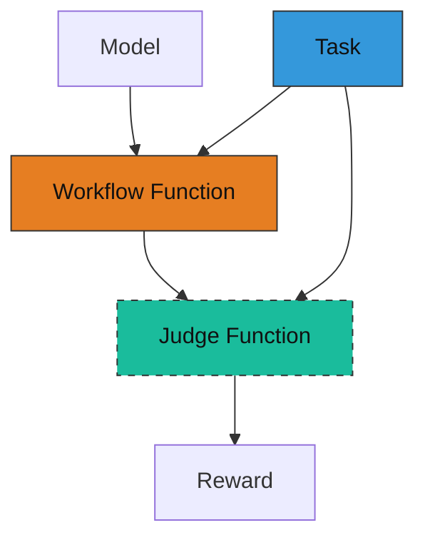

# AgentScope Tuner Quick Start Guide

AgentScope provides a `tuner` sub-module to train agent workflows using reinforcement learning (RL).
This guide walks you through the steps to implement and train an agent workflow using RL with AgentScope Tuner.

## Overview

To train your agent workflow using RL, you need to understand three components:

1. **Workflow function**: Refactor your agent workflow into a workflow function that follows the specified input/output signature.
2. **Judge function**: Implement a judge function that computes rewards based on the agent's responses.
3. **Task dataset**: Prepare a dataset containing training samples for the agent to learn.

The following diagram illustrates the relationship between these components:



## How to implement

Here we use a math problem solving scenario as an example to illustrate how to implement the above three components.

Suppose you have an agent workflow that solves math problems using the `ReActAgent`.

```python
from agentscope.agent import ReActAgent

async def run_react_agent(query: str):
    # model = ...  # Initialize your ChatModel here

    agent = ReActAgent(
        name="react_agent",
        sys_prompt="You are a helpful math problem solving agent.",
        model=model,
        enable_meta_tool=True,
        formatter=OpenAIChatFormatter(),
    )

    response = await agent.reply(
        msg=Msg("user", query, role="user"),
    )

    print(response)
```

### Step 1: Prepare task dataset

To train the agent solving math problems, you need a training dataset that contains samples of math problems and their corresponding ground truth answers.

The dataset should be organized in huggingface [datasets](https://huggingface.co/docs/datasets/quickstart) format and can be loaded using the `datasets.load_dataset` function. For example:

```
my_dataset/
    ├── train.jsonl  # samples for training
    └── test.jsonl   # samples for evaluation
```

Suppose your `train.jsonl` contains samples like:

```json
{"question": "What is 2 + 2?", "answer": "4"}
{"question": "What is 4 + 4?", "answer": "8"}
```

Note that the task sample format can vary based on your specific scenario. The key point is that each sample should contain the necessary information for the agent to complete the task and for judging the quality of the response.

You can preview your dataset using the following code:

```python
from agentscope.tuner import DatasetConfig

DatasetConfig(path="my_dataset", split="train").preview()

# Output:
# [
#   {
#     "question": "What is 2 + 2?",
#     "answer": "4"
#   },
#   {
#     "question": "What is 4 + 4?",
#     "answer": "8"
#   }
# ]
```

### Step 2: Define a workflow function

To train an agent workflow using RL, you need to refactor your agent with the following signature.

```python
async def workflow_function(
    task: Dict,
    model: ChatModelBase,
    auxiliary_models: Optional[Dict[str, ChatModelBase]]=None,
) -> WorkflowOutput:
    """Run the agent workflow on a single task and return a scalar reward."""
```

- Inputs:
    - `task`: A dictionary representing a single training task, converted from a sample in the training dataset. For example, if using the dataset prepared in Step 1, the `task` is a dictionary containing `question` and `answer` fields.
    - `model`: A `ChatModelBase` instance, which has the same interface as `OpenAIChatModel`, but it supports automatically converting invoke history into trainable data.
    - `auxiliary_models`: A dictionary of auxiliary models that can be used in the workflow. The keys are model names, and the values are `ChatModelBase` instances. These models are different from the main `model` in that they are not directly trained, but can be used to assist the main model in completing the task (e.g., acting as Judge). Empty dict if no auxiliary models are needed.

- Outputs:
    - `WorkflowOutput`: An object containing the output of the workflow function, which contains:
        - `reward`: A scalar float representing the reward obtained from the workflow function. Fill this field if you want to directly output the reward from the workflow function. Otherwise, you can leave it as `None` and implement the reward calculation in the judge function.
        - `response`: The output from the workflow function, which can be the agent's response or other types of outputs depending on your workflow function implementation. Used for reward calculation in the judge function. If you don't need to calculate reward in the judge function, you can leave it as `None`.
        - `metrics`: A dictionary of additional metrics that can be logged during training. Leave it as `None` if no additional metrics are needed.


Below is a refactored version of the original `run_react_agent` function to fit the workflow function signature.

**There are only 3 minor changes from the original function**:

1. use the input `model` to initialize the agent.
2. use the `question` field from the `task` dictionary as the user query.
3. return a `WorkflowOutput` object containing the agent's response.

```python
from agentscope.agent import ReActAgent
from agentscope.formatter import OpenAIChatFormatter
from agentscope.tuner import WorkflowOutput
from agentscope.message import Msg

async def run_react_agent(
    task: Dict,
    model: ChatModelBase,
    auxiliary_models: Optional[Dict[str, ChatModelBase]]=None,
) -> WorkflowOutput:
    agent = ReActAgent(
        name="react_agent",
        sys_prompt="You are a helpful math problem solving agent.",
        model=model,  # directly use the trainable model here
        formatter=OpenAIChatFormatter(),
    )

    response = await agent.reply(
        msg=Msg("user", task["question"], role="user"),  # extract question from task
    )

    return WorkflowOutput(  # put the response into WorkflowOutput
        response=response,
    )
```

### Step 3: Implement the judge function

To train the agent using RL, you need to define a judge function that computes a reward following the signature below.

```python
async def judge_function(
    task: Dict,
    response: Any,
    auxiliary_models: Dict[str, ChatModelBase],
) -> JudgeOutput:
    """Calculate reward based on the input task and agent's response."""
```

- Inputs:
    - `task`: A dictionary representing a single training task, same as the input to the workflow function.
    - `response`: The output from the workflow function, which can be the agent's response or other types of outputs depending on your workflow function implementation.
    - `auxiliary_models`: A dictionary of auxiliary models that can be used in the reward calculation. The keys are model names, and the values are `ChatModelBase` instances. These models are different from the main model in that they are not directly trained, but can be used to assist in calculating the reward (e.g., acting as Judge). Empty dict if no auxiliary models are needed.

- Outputs:
    - `JudgeOutput`: An object containing the output of the judge function. It contains:
        - `reward`: A scalar float representing the reward calculated based on the input task and agent's response. This field must be filled.
        - `metrics`: A dictionary of additional metrics that can be logged during training. Leave it as `None` if no additional metrics are needed.

Here is an example implementation of a simple reward calculation mechanism that gives a reward of `1.0` for an exact match between the agent's answer and the ground truth answer, and `0.0` otherwise.

> Note: This is a toy reward function; in practice, you need to parse the agent's response to extract the final answer before comparing it with the ground truth. You may also want to use a more robust metric for reward calculation.

```python
from agentscope.message import Msg
from agentscope.tuner import JudgeOutput

async def judge_function(
    task: Dict, response: Msg, auxiliary_models: Dict[str, ChatModelBase]
) -> JudgeOutput:
    """Simple reward: 1.0 for exact match, else 0.0."""
    ground_truth = task["answer"]
    reward = 1.0 if ground_truth in response.get_text_content() else 0.0
    return JudgeOutput(reward=reward)
```

> Tip: You can leverage existing [`MetricBase`](https://github.com/agentscope-ai/agentscope/blob/main/src/agentscope/evaluate/_metric_base.py) implementations in your judge function to compute more sophisticated metrics and combine them into a composite reward.

### Step 4: Start tuning

Finally, you can use the `tune` interface to train the defined workflow function with a configuration file.

```python
from agentscope.tuner import tune, AlgorithmConfig, DatasetConfig, TunerModelConfig

# your workflow / judge function here...

if __name__ == "__main__":
    dataset = DatasetConfig(path="my_dataset", split="train")
    model = TunerModelConfig(model_path="Qwen/Qwen3-0.6B", max_model_len=16384)
    algorithm = AlgorithmConfig(
        algorithm_type="multi_step_grpo",
        group_size=8,
        batch_size=32,
        learning_rate=1e-6,
    )
    tune(
        workflow_func=run_react_agent,
        judge_func=judge_function,
        model=model,
        train_dataset=dataset,
        algorithm=algorithm,
    )
    # for advanced users, you can pass in config_path to load config from a YAML file
    # and ignore other arguments
    # tune(
    #     workflow_func=run_react_agent,
    #     judge_func=judge_function,
    #     config_path="config.yaml",
    #)
```

Here, we use `DatasetConfig` to load the training dataset, `TunerModelConfig` to initialize the trainable model, and `AlgorithmConfig` to specify the RL algorithm and its hyperparameters.

> Note:
> The `tune` function is based on [Trinity-RFT](https://github.com/agentscope-ai/Trinity-RFT) and it converts the input parameters into a YAML configuration internally.
> Advanced users can ignore `model`, `train_dataset`, `algorithm` arguments and provide a configuration file path pointing to a YAML file using the `config_path` argument instead (see [config.yaml](./config.yaml) for an example).
> We recommend using the configuration file approach for fine-grained control over the training process and leveraging advanced features provided by Trinity-RFT.
> You can refer to the Trinity-RFT [Configuration Guide](https://agentscope-ai.github.io/Trinity-RFT/en/main/tutorial/trinity_configs.html) for more details on configuration options.

The checkpoint and logs will automatically be saved to the `checkpoints/AgentScope` directory under the current working directory and each run will be save in a sub-directory suffixed with current timestamp.
You can found the tensorboard logs inside `monitor/tensorboard` of the checkpoint directory.

```
react_agent/
    └── checkpoints/
        └──AgentScope/
            └── Experiment-20260104185355/  # each run saved in a sub-directory with timestamp
                ├── monitor/
                │   └── tensorboard/  # tensorboard logs
                └── global_step_x/    # saved model checkpoints at step x
```

---

### Complete example

```python
from typing import Dict

from agentscope.tuner import tune, WorkflowOutput, JudgeOutput, DatasetConfig, AlgorithmConfig
from agentscope.agent import ReActAgent
from agentscope.model import ChatModelBase
from agentscope.formatter import OpenAIChatFormatter
from agentscope.message import Msg


async def run_react_agent(
    task: Dict,
    model: ChatModelBase,
    auxiliary_models: Dict[str, ChatModelBase],
) -> WorkflowOutput:
    agent = ReActAgent(
        name="react_agent",
        sys_prompt="You are a helpful math problem solving agent.",
        model=model,  # directly use the trainable model here
        formatter=OpenAIChatFormatter(),
    )

    response = await agent.reply(
        msg=Msg("user", task["question"], role="user"),  # extract question from task
    )

    return WorkflowOutput(
        response=response,
    )


async def judge_function(
    task: Dict, response: Msg, auxiliary_models: Dict[str, ChatModelBase]
) -> JudgeOutput:
    """Simple reward: 1.0 for exact match, else 0.0."""
    ground_truth = task["answer"]
    reward = 1.0 if ground_truth in response.get_text_content() else 0.0
    return JudgeOutput(reward=reward)


if __name__ == "__main__":
    dataset = DatasetConfig(path="my_dataset", split="train")
    model = TunerModelConfig(model_path="Qwen/Qwen3-0.6B", max_model_len=16384)
    algorithm = AlgorithmConfig(
        algorithm_type="multi_step_grpo",
        group_size=8,
        batch_size=32,
        learning_rate=1e-6,
    )
    tune(
        workflow_func=run_react_agent,
        judge_func=judge_function,
        model=model,
        train_dataset=dataset,
        algorithm=algorithm,
    )
```

> Note:
> Above code is a simplified example for illustration purposes only.
> For a complete implementation, please refer to [main.py](./main.py), which trains a ReAct agent to solve math problems on the GSM8K dataset.

---

## How to run

After implementing the workflow function, follow these steps to run the training:

1. Prerequisites

    - At least 2 NVIDIA GPUs with CUDA 12.8 or newer.
    - Adjust the configuration file ([config.yaml](./config.yaml)) based on your hardware.
    - Follow the Trinity-RFT [installation guide](https://agentscope-ai.github.io/Trinity-RFT/en/main/tutorial/trinity_installation.html) to install the latest version from source code.
    - Download the GSM8K dataset and Qwen/Qwen3-0.6B model checkpoints (example):

      ```bash
      huggingface-cli download openai/gsm8k --repo-type dataset
      huggingface-cli download Qwen/Qwen3-0.6B
      ```

2. Set up a [Ray](https://github.com/ray-project/ray) cluster

    ```bash
    ray start --head
    # for multi-node setup, run the following command on worker nodes
    # ray start --address=<master_address>
    ```

3. Run the training script

    ```bash
    python main.py
    ```

4. The reward curve and other training metrics can be monitored using TensorBoard:

    ```bash
    tensorboard --logdir ./checkpoints/AgentScope/Experiment-xxxxxx/monitor/tensorboard
    ```

    An example reward curve is shown below:

    

> [!TIP]
> For more tuning examples, refer to [tuner](https://github.com/agentscope-ai/agentscope-samples/tree/main/tuner) directory of the AgentScope-Samples repository.
